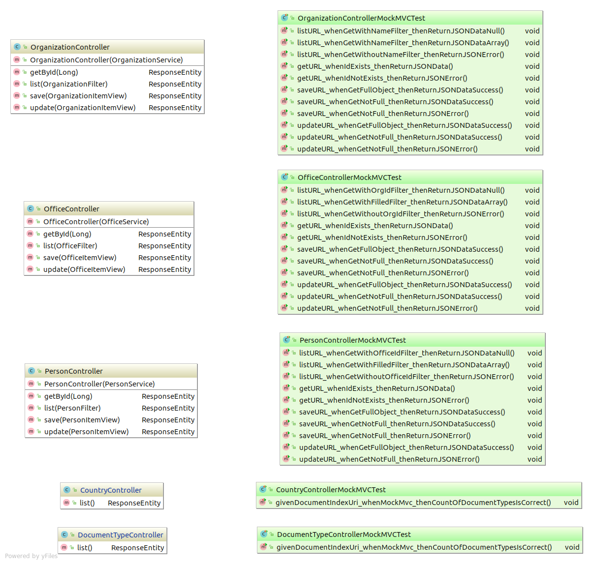

# Organizations-task
It is a simple REST API Spring project. 

To run the project run `mvn spring-boot:run`. Looking for it on localhost:8080/

To execute tests run the following command: `mvn test | grep "Tests" && mvn clean` 

